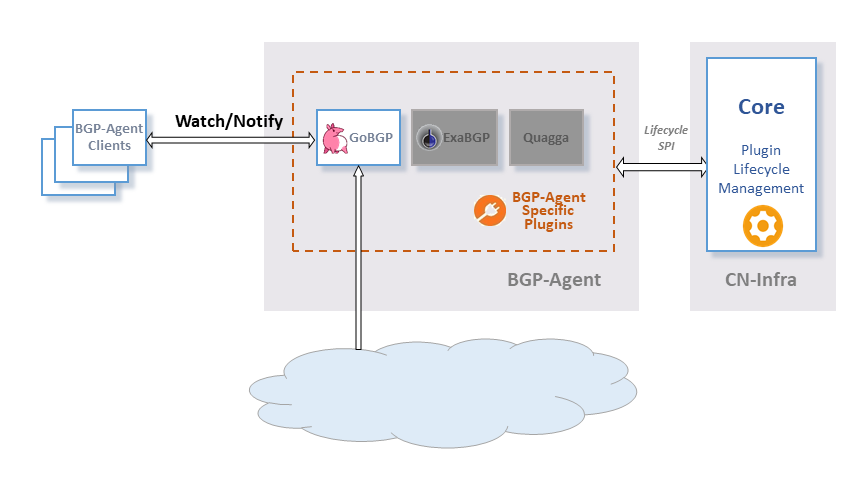

# Ligato BGP Agent

The `Ligato BGP Agent` is a BGP information provider. It provides BGP information in an unified format to allow to retrieve BGP information from different sources(different BGP frameworks, eg: GoBGP, ExaBGP) and supporting multiple extensions (different AFI/SAFIS ex: IPV4 / Unicast, IPV6 / Unicast).
## Architecture

The architecture of the `Ligato BGP Agent` is shown in the following figure.

`Ligato BGP Agent` is set of `Ligato CN-Infra Plugin` implementations. Purpose of each plugin is to forward retrieved BGP information to clients(registered watchers). 

Every plugin has its source of BGP information (GoBGP,ExaBGP, Quagga). Communication with the source is vendor specific and therefore also the retrieved BGP information is usually vendor specific. The BGP information is translated into unified format and forwarded to clients. If the source of the BGP information supports listening for updates, plugin forwards to its clients also informations from updates.

Clients can register directly to plugins, choosing what information they want to consume. Each plugin can expose different set of BGP informations depending at capabilities of their source(GoBGP,ExaBGP,...) or plugin's client target(different plugins for different AFI/SAFI). But each type of BGP information, no matter from which plugin it came, has the same unified format. Also plugins can be clients to other plugins.

Currently, only [GoBGP plugin](bgp/gobgp/README.md) that exposes IPv4 reachable routes is available. ExaBGP,Quagga plugins are not implemented.

## Documentation
GoDoc can be browsed [online](https://godoc.org/github.com/ligato/bgp-agent).

## Contribution:
If you are interested in contributing, please see the [Ligato CN-Infra contribution guidelines](https://github.com/ligato/cn-infra/blob/master/CONTRIBUTING.md). The `Ligato BGP Agent` follows the same contribution guidlines as the [Ligato CN-Infra](https://github.com/ligato/cn-infra).
