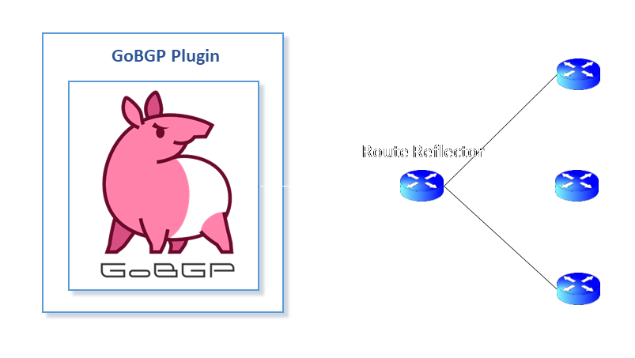

## Ligato BGP GoBGP Plugin

The `Ligato GoBGP plugin` is a `Ligato CN-Infra Plugin` implementation using [GoBGP](https://github.com/osrg/gobgp) Library as source of the BGP information. 



GoBGP library uses the BGP protocol to retrieve the information from the neighbour nodes (i.e. Route reflector) and reflects them to the `GoBGP plugin`. Currently, the `GoBGP plugin` accepts only the IPv4 reachable routes from the GoBGP library. The [reachable routes](../agent.go) are afterwards forwarded to all registered watchers of the `GoBGP plugin`.

To acquire IPv4 reachable routes using `GoBGP plugin` we must do 2 things:
1. Configure GoBGP library to communicate to neighbours(i.e. to Route Reflector). We can do this by injecting configuration into constructor `gobgp.New(...)`, i.e.:
```
import "github.com/osrg/gobgp/config"
...
  gobgp.New(Deps{
    SessionConfig: &config.Bgp{
	  Global: config.Global{    //configuring goBGP network node
	    Config: config.GlobalConfig{
	      As:       65000,
	      RouterId: "172.18.0.1",
	      Port:     -1,
	    },
	  },      ...
      Neighbors: []config.Neighbor{   //configuring initially known neighbors
        config.Neighbor{
          Config: config.NeighborConfig{
            PeerAs:          65001,
            NeighborAddress: "172.18.0.2",
          },
        },
      },
    },
  })
```
or by using external yaml configuration file. For example, if we name the plugin `goBgpPlugin`
```
goBgpPlugin := gobgp.New(gobgp.Deps{
    PluginInfraDeps: *flavor.InfraDeps("goBgpPlugin", local.WithConf()),...})
```
then we can define absolute path to the plugin's config by adding parameter to the go program launch 
```
[terminal]$ go run main.go --goBgpPlugin-config=/home/user/myexternalconfig.yaml
```
In case of using both configuration methods, the external configuration is more important and will overrride any injected configuration.
2. Become registered watcher of `GoBGP plugin`. We can do it by using `WatchIPRoutes(...)`, i.e.:
```
	// start watching
	watchRegistration, startErr := gobgpPlugin.WatchIPRoutes("watcherName1", func(route *bgp.ReachableIPRoute) {
		fmt.Printf("Just received new IPv4 reachable route: %+v ", route)
	})
	...
	// end watching
	closeErr := watchRegistration.Close()
```

For further usage please look into our [example](https://github.com/ligato/bgp-agent/tree/master/example/gobgp).
