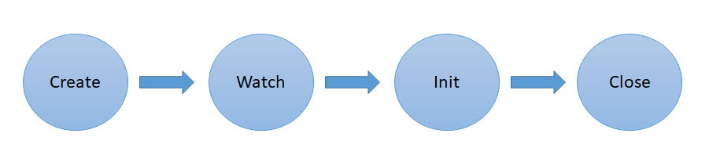

# Ligato GoBGP Plugin Example

Contains an example with full workflow expected for `Ligato BGP Plugin` and how to use it.
It can be tested running [Route Reflector GoBGP docker](../route-reflector-gobgp-docker) .


### Example run    

We will need 2 linux terminals. To differentiate commands in terminal we will use different [prompt string](http://www.linuxnix.com/linuxunix-shell-ps1-prompt-explained-in-detail) for each terminal:

* The terminal for Running go example inside the VPP-endpoint docker container. 

`[rr-bgp-server]$` 

* The terminal for BGP server inside the Route reflector docker container that acts as a Route reflector. We can see logs of the BGP server here.

`[rr-manual-info-addition]$` 

Lets run the example:

```
[rr-bgp-server]$ cd $GOPATH/src/github.com/ligato/bgp-agent/route-reflector-gobgp-docker
```
Start the route reflector docker container
```
[rr-bgp-server]$ ./start-routereflector-for-client-in-host.sh
```

<b>2. Run the go code example</b> 

Run the main application, it will initially take around ~20 seconds to establish session. 
Then it will be ready and waiting for any path advertizement reception.

<b>3. Add new route information to the Route reflector</b>

Switch to the ```[rr-manual-info-addition]``` terminal and change the directory so we can use the helper scripts in the route reflector docker folder
```
[rr-manual-info-addition]$ cd $GOPATH/src/github.com/ligato/bgp-agent/route-reflector-gobgp-docker
```
Connect to the bash console inside the Route reflector docker container
```
[rr-manual-info-addition]$ ./connect-to-routereflector.sh
```
Add new prefix(`101.0.0.0/24`)/nexthop(`192.168.1.1`) information to the Route reflector
```
[rr-manual-info-addition]$ gobgp global rib add -a ipv4 101.0.0.0/24 nexthop 101.0.10.1
``` 

<b>4. Verify the advertizement of the path</b>
 
In console we should see that new path arrived to `Ligato BGP Plugin` and it was notified to the subscribed channel.
```
"Agent received new path {65001 101.0.0.0/24 101.0.10.1}"
```

<b>5. Finish example</b>

Upon reception of the information, and propagation through the channel, example will finish closing the plugin and ending the application.

### Plugin workflow    



`Ligato BGP Plugin` workflow consist on 4 steps:

<b>1</b> Create the plugin

<b>2</b> Register/subscribe consumer to notifications for any new learned IP-based routes via WatchIPRoutes method

<b>3</b> Initialize plugin config and start plugin via Init method

<b>4</b> Finally clean up and close the plugin via Close method
