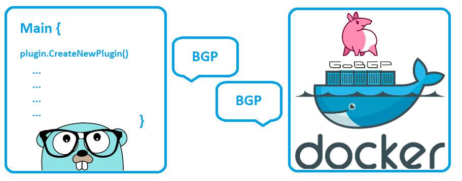
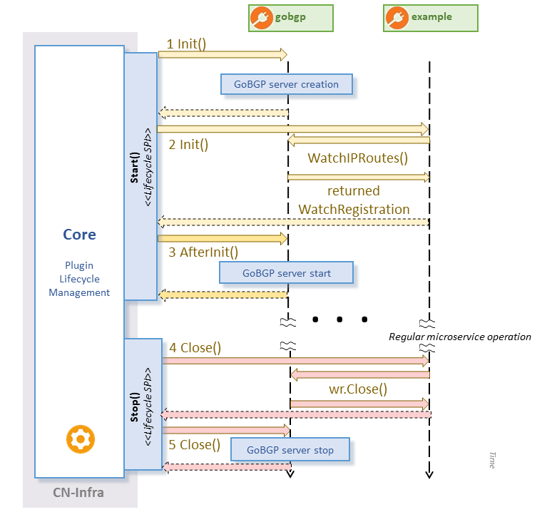

# Ligato GoBGP Plugin Example

The example demonstrates the usage of the `Ligato GoBGP Plugin`.
### Architecture

Architecture consists of 2 `Ligato CN-Infra` plugins and the [Route Reflector](../route-reflector-gobgp-docker) in docker container. The lifecycle of plugins is controlled by [CN-Infra](https://github.com/ligato/cn-infra) Core component. The Example plugin will communicate with the `GoBGP plugin` and the `GoBGP plugin` will be communicating with Route reflector node(implemented by [GoBGP](https://github.com/osrg/gobgp)) using BGP protocol. Any new learned reachable routes from the Route reflector will be passed through the `GoBGP Plugin` to the Example plugin. The Example plugin will write received route to the console.

### Infrastructure setup
To be able to run this example you must setup the infrastructure first.  
At this point, it is expected that you have:
 * Installed the docker CE (docker engine version >=1.10). If you haven't please install it(for [ubuntu](https://docs.docker.com/engine/installation/linux/docker-ce/ubuntu/) or [other](https://docs.docker.com/engine/installation/)). 
 * Installed Go (also properly filled the [GOPATH environment variable](https://github.com/golang/go/wiki/Setting-GOPATH)) 
 * Downloaded the [Ligato BGP-Agent](https://github.com/ligato/bgp-agent). In case of you haven't, just run:
```
go get github.com/ligato/bgp-agent
```
Change the path to the  docker folder
```
cd $GOPATH/src/github.com/ligato/bgp-agent/docker
```
Build the Route reflector docker image
```
./build-image-routereflector.sh
``` 
Now you should see something like this:

```
REPOSITORY                 TAG                 IMAGE ID            CREATED             SIZE
routereflector             latest              a6d47c8559da        11 seconds ago      982MB
```
Process of building of the images has downloaded also other images that served as base images in the creation process. You can delete these base images if you want.

To be able to have static ip addresses for running docker images, we need to create separate network that can be used by docker.
```
./create-ligato-network-for-docker.sh
```    


### Example run    

We will need 3 linux terminals. To differentiate commands in terminal we will use different [prompt string](http://www.linuxnix.com/linuxunix-shell-ps1-prompt-explained-in-detail) for each terminal:

`[rr-bgp-server]$` 

* The terminal for BGP server inside the Route reflector docker container that acts as a Route reflector. We can see logs of the BGP server here.

`[rr-manual-info-addition]$` 

* The terminal for adding the prefix/nexthop information directly to the BGP server(acting like Route reflector) in the Route reflector docker container. 

`[host-go-runtime]$`

* The terminal for running go example. 

Lets run the example:

<b>1. Start the Route reflector docker containers.</b>

Change the directory so we can use the helper scripts in the Route reflector docker folder 

```
[rr-bgp-server]$ cd $GOPATH/src/github.com/ligato/bgp-agent/docker
```
Start the route reflector docker container
```
[rr-bgp-server]$ ./start-routereflector-for-client-in-host.sh
```

<b>2. Run the go code example</b> 

Switch to `[host-go-runtime]` terminal and change directory to gobgp example directory
```
[host-go-runtime]$ cd $GOPATH/src/github.com/ligato/bgp-agent/example/gobgp
```
Run the main application
```
[host-go-runtime]$ go run base.go
```
It will initially take around ~20 seconds to establish session.Then it will be ready and waiting for any path advertizement reception.

<b>3. Add new route information to the Route reflector</b>

Switch to the ```[rr-manual-info-addition]``` terminal and change the directory so we can use the helper scripts in the route reflector docker folder
```
[rr-manual-info-addition]$ cd $GOPATH/src/github.com/ligato/bgp-agent/docker
```
Connect to the bash console inside the Route reflector docker container
```
[rr-manual-info-addition]$ ./connect-to-routereflector.sh
```
Add new prefix(`101.0.0.0/24`)/nexthop(`192.168.1.1`) information to the Route reflector
```
[rr-manual-info-addition]$ gobgp global rib add -a ipv4 101.0.0.0/24 nexthop 101.0.10.1
``` 

<b>4. Verify the advertizement of the path</b>
 
Switch back to `[host-go-runtime]` terminal. You should see that new path arrived to `Ligato BGP Plugin` and it was notified to the subscribed channel.
```
"Agent received new path {65001 101.0.0.0/24 101.0.10.1}"
```

<b>5. Observe the automatic end of the example</b>

Upon reception of the information, and propagation through the channel, the example will finish closing the plugin and ending the application. You can observe that in `[host-go-runtime]` terminal. 

### Plugin workflow    
Plugin Example and goBGP are created and passed to `Ligato CN-infra agent` for handling their lifecycle:



<b>1.</b> By goBGP plugin initialization, GoBGP server is created.

<b>2.</b> Example plugin is initialized. It calls `WatchIPRoutes(...)` to become registered watcher. GoBGP plugin registers the Example plugin as watcher and returns to it `WatchRegistration`. The `WatchRegistration` will serve later for registration cancellation.   

<b>3.</b> GoBGP plugin starts GoBGP server. From this point, the Example plugin will receive new advertized routes until registration cancelation (or GoBGP server stop).

<b>4.</b> Closing of the Example plugin will trigger registration cancellation (call to `Close()` on `WatchRegistration`).

<b>5.</b> Closing of GoBGP plugin will also stop the GoBGP server.

This workflow was examplary and the order of plugins in which it is called `Init()` is not important. Important is that all watcher plugins must register before the start of GoBGP server, i.e. in their `Init()`. Also order of closing is not important, because watcher either calls `Close()` on `WatchRegistration` and stop watching or GoBGP server stops and watcher won't get anything from that point on. 
